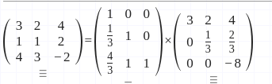
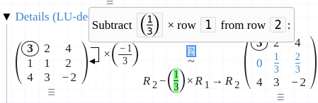
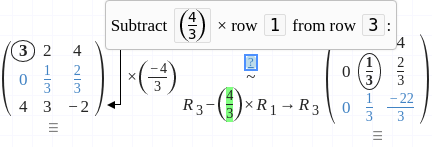
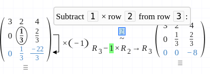

# LU Decomposition

LU Decomposition: factors a matrix as the product of a lower triangular matrix and an upper triangular matrix. The product sometimes includes a permutation matrix as well. The LU decomposition can be viewed as  the matrix form of Gaussian elimination. Computers usually solve square systems of linear equations using the LU decomposition, and it is also a key step when inverting a matrix, or computing the determinant of a matrix. The LU decomposition was introduced by mathematician Banachiewicz in 1938.

[LUfactorization.pdf](LUfactorization-a42869e4-fa76-4a7a-9b88-614989d35fa9.pdf)

### Video aula com exemplo:

[https://www.youtube.com/watch?v=AtxPrtmo0OA](https://www.youtube.com/watch?v=AtxPrtmo0OA)

### Online Solver (com ou sem pivô)

[https://epxx.co/artigos/ludecomp.html](https://epxx.co/artigos/ludecomp.html)

### Online Solver (copiável, colável, com solução em detalhe)

[https://matrixcalc.org/en/](https://matrixcalc.org/en/)

## Algoritmo Sequencial:

    for (int k = 0; k < N; k++) {
            /* DivisioN step */
            for (int i = k + 1; i < N; i++) {
                a[i][k] = a[i][k] / a[k][k];
            }
            /* ElimiNatioN step */
            for (int i = k + 1; i < N; i++) {
                for (int j = k + 1; j < N; j++) {
                    a[i][j] = a[i][j] - (a[i][k] * a[k][j]);
                }
            }
        }

### Matriz Exemplo:

3.0 2.0 4.0
1.0 1.0 2.0
4.0 3.0 -2.0

